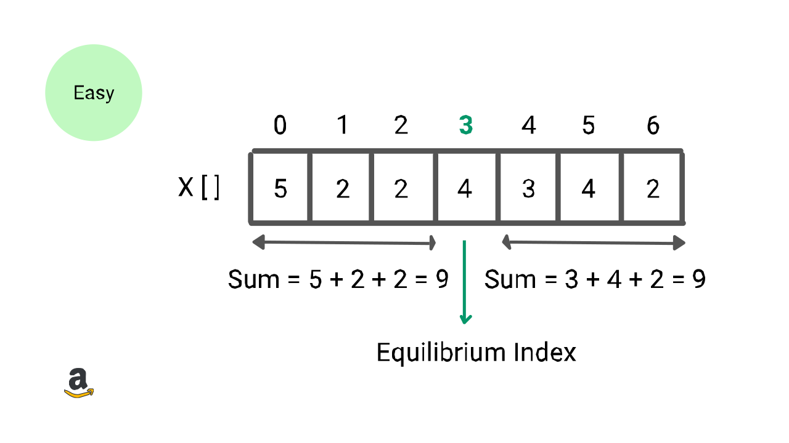

# Tìm Chỉ Mục Cân Bằng Trong Mảng



- *Cấp độ*: Dễ
- *Hỏi bởi*: Amazon, Adobe, Hike

## Làm rõ vấn đề

Viết một chương trình tìm chỉ mục cân bằng của mảng. Chỉ mục cân bằng của mảng là một chỉ mục mà tổng các phần tử có chỉ mục nhỏ hơn nó bằng với tổng các phần tử có chỉ mục lớn hơn nó. Dễ hiểu hơn, ta có chỉ mục cân bằng `i` của một mảng với tổng phần tử ở chỉ mục trước `i` bằng với tổng phần tử ở chỉ mục sau `i`.

```
A[0] + A[1] + ... + A[i-1] = A[i+1] + ... + A[n-1], 0 <= i <= n-1
```

**Lưu ý**

- Với `i=0`, ta giả sử tổng phần tử trước `i` sẽ bằng 0.
- Với `i=n-1`, ta giả sử tổng phần tử sau `i` sẽ bằng 0.

### Ví dụ 1

Input: A[] = [-7, 1, 5, 2, -4, 3, 0]
Output: 3

*Giải thích:* 3 là chỉ mục cần bằng vì A[0] + A[1] + A[2] = A[4] + A[5] + A[6] = -1

### Ví dụ 2

Input: A[] = [0, 1, 3, -2, -1]
Output: 1

*Giải thích*: 1 là chỉ mục cân bằng vì A[0] = A[2] + A[3] + A[4] = 0

### Ví dụ 3

Input: A[] = [1, 2, -2, -1]
Output: -1

*Giải thích*: Không có chỉ mục cân bằng

## Một vài giải pháp tiêu biểu

- Phương pháp brute force dùng vòng lặp lồng nhau
- Phương pháp mảng tiền tố với một vòng lặp
- Phương pháp sử dụng vòng lặp hiệu quả

## Phương pháp brute force dùng vòng lặp lồng nhau

### Ý tưởng

Ý tưởng cơ bản để tìm ra chỉ mục `i` là tính tổng tất cả phần tử ở bên trái và phải, ngoại trừ giá trị ở chỉ mục `i`. Nếu tổng cả hai bên trái và phải đều bằng nhau, thì chỉ mục `i` sẽ là chỉ mục cân bằng.

Ta cần sử dụng vòng lặp lồng nhau để triển khai: một vòng lặp bên ngoài để duyệt qua tất cả chỉ mục `i`, vòng lặp bên trong để xác định chỉ mục `i` có phải chỉ mục cân bằng không bằng cách tính tổng trái và tổng phải. Ta sử dụng hai biến mở rộng là `leftSum` và `rightSum` để lưu tổng phần tử ở hai phía của chỉ mục hiện tại

### Thực hiện

1. Ta khai báo hai biến **leftSum** và **rightSum**.
2. Bây giờ ta chạy vòng lặp từ `i=0` đến `n-1`. Bên trong vòng lặp, ta tìm tổng phần tử ở hai bên của chỉ mục hiện tại.
3. Ta khởi tạo `leftSum` bằng 0 và chạy vòng lặp `j=0` đến `i-1` để tính leftSum.

```
for (int j=0; j < i; j++) 
    leftSum = leftSum + A[j]
```
4. Ta khởi tạo `rightSum` bằng 0 và chạy vòng lặp `j=i+1` đến `n-1` để tính rightSum.

```
for (int j=i+1; j < n; j++) 
    rightSum = rightSum + A[j]
```
5. Nếu leftSum và rightSum bằng nhau, thì chỉ mục `i` hiện tại chính là chỉ mục cân bằng và trả về `i` cho output.

```
if (leftSum === rightSum)
    return i
```
6. Nếu vòng lặp bên ngoài kết thúc, ta trả về **-1** vì không tìm được chỉ mục cân bằng

### Mã giả

```
int equilbrimIndex(int A[], int n) {
    int leftSum, rightSum
    for (int i=0; i<n; i=i+1) {

        leftSum = 0
        for (int j=0; j<i; j=j+1)
            leftSum = leftSum + A[j]

        rightSum = 0
        for (int j=i+1; j < n; j=j+1) 
            rightSum = rightSum + A[j]
        
        if (leftSum === rightSum)
            return i
    }
    return -1
}
```

### Phân tích

Ta chạy vòng lặp lồng nhau để tính leftSum và rightSum tại mọi chỉ mục i. Bên trong vòng lặp bên ngoài, 