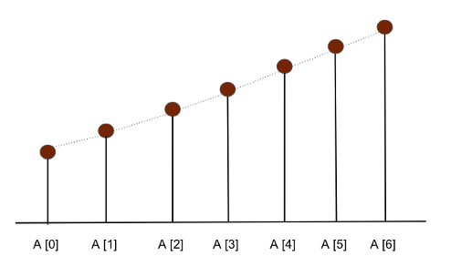
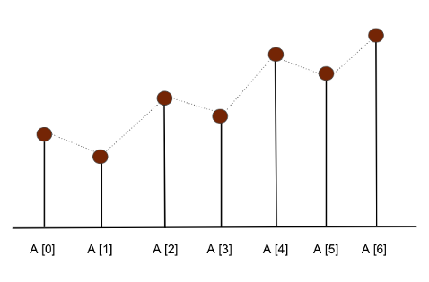

# Sắp xếp mảng theo dạng sóng

- *Độ khó*: Dễ
- *Hỏi bởi*: Amazon, Google

## Làm rõ vấn đề 

Cho một mảng số nguyên, sắp xếp mảng lại theo dạng hình sóng. Nói cách khác, với mảng `A[0...n-1]` được sắp xếp lại sao cho A[0] >= A[1] <= A[2] >= A[3] <= A[4] >= ...

**Lưu ý**: Với một mảng đầu vào sẽ có nhiều kết quả đầu ra khác nhau, song cái ta cần là kết quả trả về có dạng hình sóng.

#### Ví dụ 1

Input: A[] = [1, 2, 3, 4]

Output: A[] = [2, 1, 4, 3] hoặc [4, 1, 3, 2] hoặc bất kỳ cấu trúc dạng sóng nào.

#### Ví dụ 2

Input: A[] = [20, 10, 8, 6, 4, 2]

Output: A[] = [20, 8, 10, 4, 6, 2] hoặc [10, 8, 20, 2, 6, 4] hoặc bất kỳ cấu trúc dạng sóng nào.

## Giải pháp

- Giải pháp sắp xếp với brute force.
- Giải pháp hiệu quả bằng cách dùng một vòng lặp.

### Giải pháp sắp xếp với brute force

#### Ý tưởng

Các giá trị được tổ chức theo trật tự luân phiên giữa giá trị lớn và nhỏ theo dạng hình sóng. Thế điều gì sẽ xảy ra nếu ta chuyển đổi input đầu vào theo trật tự này? Ý tưởng ở đây là: nếu mảng đầu ra của ta được sắp xếp, ta có thể hoán đổi phần tử để đạt được dạng hình sóng!

Với mảng đã được sắp xếp, tất cả các phần tử sẽ được tổ chức theo thứ tự tăng dần như A[0] <= A[1] <= A[2] <= A[3] <= ... <= A[n-2] < A[n-1]. Thế nên nếu ta hoán đổi mỗi cặp phần tự từ đầu ta sẽ có được trật tự được sắp xếp theo dạng sóng.

Ảnh minh hoạ một mảng được sắp xếp



Ảnh minh hoạ sau khi hoán đổi các cặp phần tử trong mảng đã sắp xếp



#### Mã giả

```c
void waveForm(int A[], int n) {
    sort(A, n)
    for (int i = 0; i < n-1; i = i+2)
        swap(A[i], A[i+1])
}
```

#### Phân tích

Ở giải pháp này, độ phức tạp thời gian bị ảnh hưởng thuật toán sắp xếp. Nó sẽ là `O(nlogn)` nếu ta sử dụng một thuật toán sắp xếp hiệu quả như quicksort, mergesort hay heapsort.

Độ phức tạp thời gian = Độ phức tạp thời gian của sắp xếp + Độ phức tạp thời gian của hoán đổi phần tử = O(nlogn) + O(n) = O(nlogn)

Độ phức tạp không gian = O(1) nếu ta dùng heapsort.

Độ phức tạp không gian = O(n) nếu ta dùng mergesort.

### Giải pháp sử dụng một vòng lặp

#### Ý tưởng

Câu hỏi cốt lõi là: ta có thể giải quyết vấn đề này với độ phức tạp thời gian O(n) nếu không sử dụng thêm thuật toán sắp xếp. 

Từ mảng đầu ra mẫu đã cho, nếu ta đảm bảo các giá trị ở tất cả vị trí chẵn đều lớn hơn các vị trí lẻ, ta có thể có được cấu trúc dạng sóng. Nói cách khác, ở mỗi chỉ mục `i`, ta cần đảm bảo nó theo cấu trúc A[i-1], A[i] và A[i+1] sao cho A[i-1] < A[i] > A[i+1].

- **Trường hợp 1:** Nếu A[i-1] < A[i] < A[i+1]
    Ta cần hoán đổi A[i] và A[i+1] để đạt được trật tự A[i-1] < A[i] > A[i+1].
- **Trường hợp 2:** Nếu A[i-1] > A[i] > A[i+1]
    Ta cần hoán đổi A[i-1] và A[i] để đạt được trật tự A[i-1] < A[i] > A[i+1].
- **Trường hợp 3:** Nếu A[i-1] > A[i] < A[i+1]
    Ta cần hoán đổi A[i-1] và A[i] để đạt được trật tự A[i-1] < A[i]. Sau đó ta hoán đổi A[i] và A[i+1] để đạt được trật tự A[i] > A[i+1].
- **Trường hợp 4:** Nếu A[i-1] < A[i] > A[i+1]
    Không cần làm gì vì trật tự đã theo thứ tự yêu cầu.

Xa hơn nếu ta đơn giản hoá các trường hợp 1, 2 và 3.

- Nếu A[i-1] > A[i], ta cần hoán đổi A[i-1] và A[i].
- Nếu A[i] < A[i+1], ta cần hoán đổi A[i] và A[i+1].

Ta có thể chạy một vòng lặp để so sánh các phần tử cạnh nhau ở tất cả vòng lặp và đảm bảo rằng tất cả phần tử ở các vị trí chẵn lớn hơn các phần tử cạnh của nó ở vị trí lẻ.

#### Các bước

1. Ta có thể chạy một vòng lặp mỗi bước tăng hai phần tử ở các vị trí chẵn.
2. Nếu phần tử hiện tại A[i] nhỏ hơn phần tử trước A[i-1] ta sẽ hoán đổi phần tử hiện tại A[i] và A[i-1].

```c
if (i > 0 && A[i-1] > A[i])
    swap(A[i], A[i-1])
```

3. Nếu phần tử hiện tại A[i] nhỏ hơn phần tử kế tiếp A[i+1], ta sẽ hoán đổi phần tử hiện tại A[i] với A[i+1].

```c
if (i > 0 && A[i] < A[i+1])
    swap(A[i], A[i+1])
```

#### Mã giả

```c
void waveForm(int A[], int n) {
    for (int i = 0; i < n; i = i+2) {
        if (i > 0 && A[i-1] > A[i])
            swap(A[i], A[i-1])
        if (i > 0 && A[i] < A[i+1])
            swap(A[i], A[i+1])
    }
}
```

#### Phân tích

Độ phức tạp thời gian cho giải pháp trên sẽ là O(n) bởi vì quá trình duyệt tuyến tính để thực hiện hành động O(1) ở mỗi vòng lặp.

Độ phức tạp không gian là O(1), ta không cần sử dụng bộ nhớ bổ sung nào.

